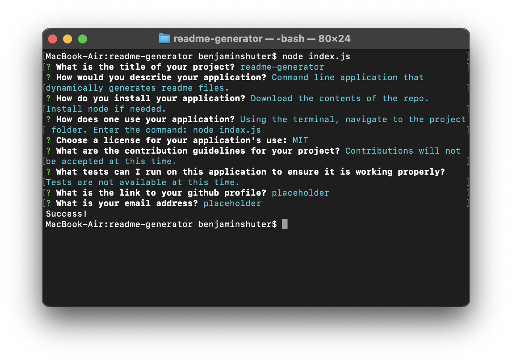
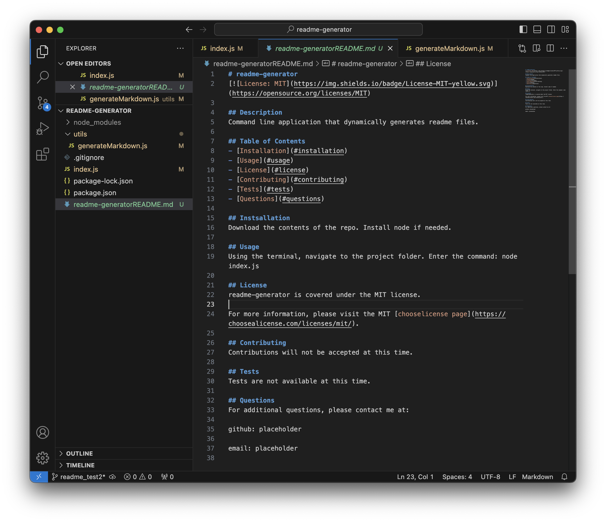

#readme-generator

##Description
A command line application that dynamically generates readme files.

##Installation
Download the contents of this repository.  Install node, if needed.

##Usage
Use the terminal to navigate to the project folder.  Enter the command: node index.js

##Screenshots

##Video
Coming soon.